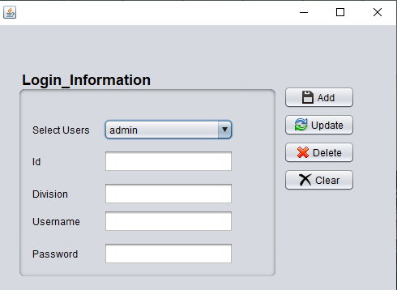
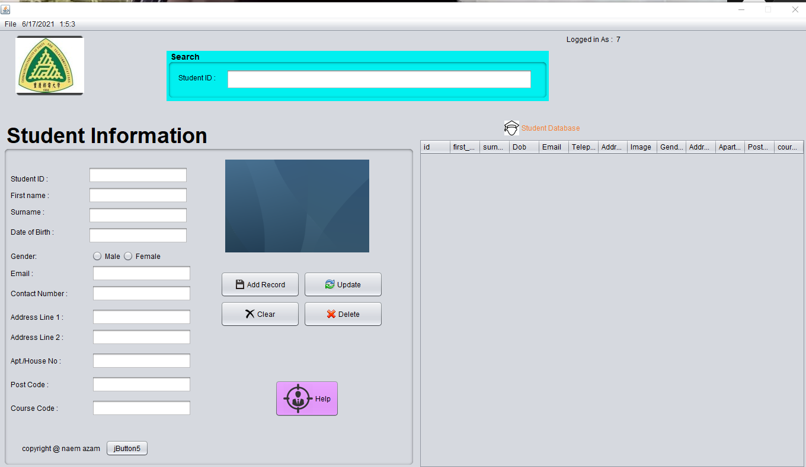
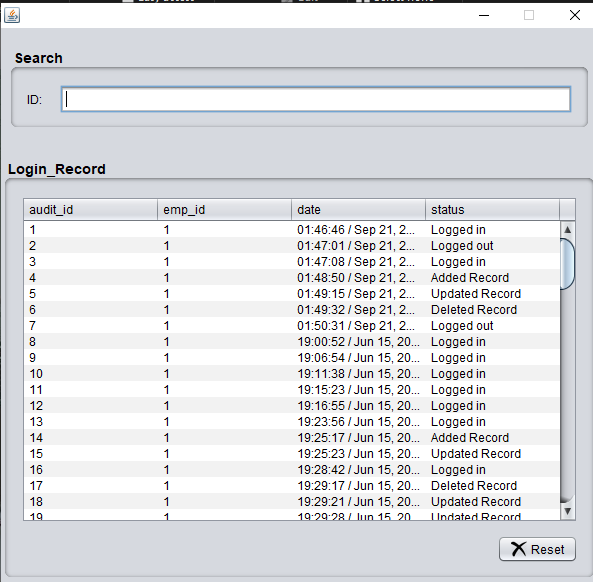
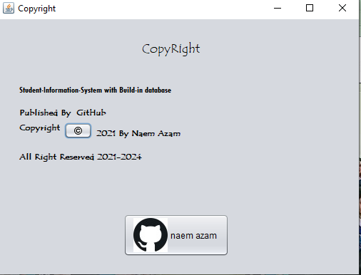

# Student-Information-System

A student information system, student management system, school administration software or student administration system is a management information system for education establishments used to manage student data.

Student Information System with build-in Database System. No need to Install Other software or Configuration. It's a all-in-one Secure Software. 


## Installation For Windows OS

Download [java](https://java.com/en/download/) and Install on system 

Use this software on Windows OS  [Download](https://github.com/naemazam/Student-Information-System/raw/main/Student%20Information%20System/Student%20Information%20System.exe) and Execute RAR file.


## Installing for Linux 

At first install Wine for running .exe file on linux 

```bash
sudo apt-get install wine32 -y && sudo apt-get install libwine -y

```
Clone it 
```bash
git clone https://github.com/naemazam/Student-Information-System.git

```

```bash
cd Student-Information-System/
```
```bash
wine  Student-Information-System

```


## User Guide

**How To Log In?** 
1. Put Right ***username*** , ***password*** and ***Division*** click **Log-In** 
2. Username: admin
Password: cqupt



**How to Add or Change New user with username and password ?** 

 - Go-To **settings** then **User Profiles** select *Username* *password* and *Division* and click **Add** 
 - Select **username** then click **Delete** for Delete any Username.  
 - user id will Random generated, all will be different. 

**How to Add New Student Information?** 

 - Go-to Student Manager from main menu 
 - **Add Record** for add new data in student database 
 - **Update** is for refresh database 
 - **Clear** for clean the boxes 
 - click **reset** to clear all values. 



**How to Search any data ?** 

 - Type  Student-ID it will auto search all of the data and show you on Boxes. 
 
 **How to Add Image on profile?** 

 - Go-to **file** on top-bar Then select **Attach image** it will select image from computer.   

 
 **How To Delete any data ?** 
 
 - Search ID of data then click **delete** then Refresh.

**How To View History ?** 

 - Go-to **sittings** then **working history**  you will get all working history on there , you can also 
 search by ID ( admin /user). 

## Contributing
Pull requests are welcome. For major changes, please open an issue first to discuss what you would like to change.

Please make sure to update tests as appropriate.

## License
[MIT](https://choosealicense.com/licenses/mit/)


